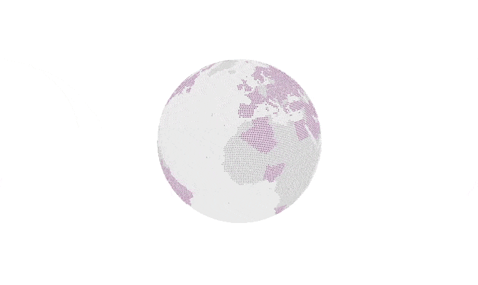

<p align="center">
  
</p>

<h1 align="center">XR Earth</h1>

<p align="center">
  
  
  
  
</p>

<br />

## Description
XR Earth is a dynamic 3D Earth built for [XR.+](https://xr.plus) website but it can be used for other website...

## Installation

Open your favorite terminal and clone this repository
```bash
git clone https://github.com/5aitama/xr-earth.git
```

Install packages
```bash
npm i
```

And now you can start server with 
```bash
npm run serve
```
Then you can open your favorite browser et go to `http://127.0.0.1:8080/` :D.
